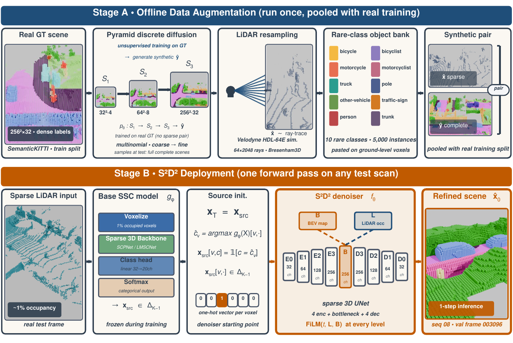
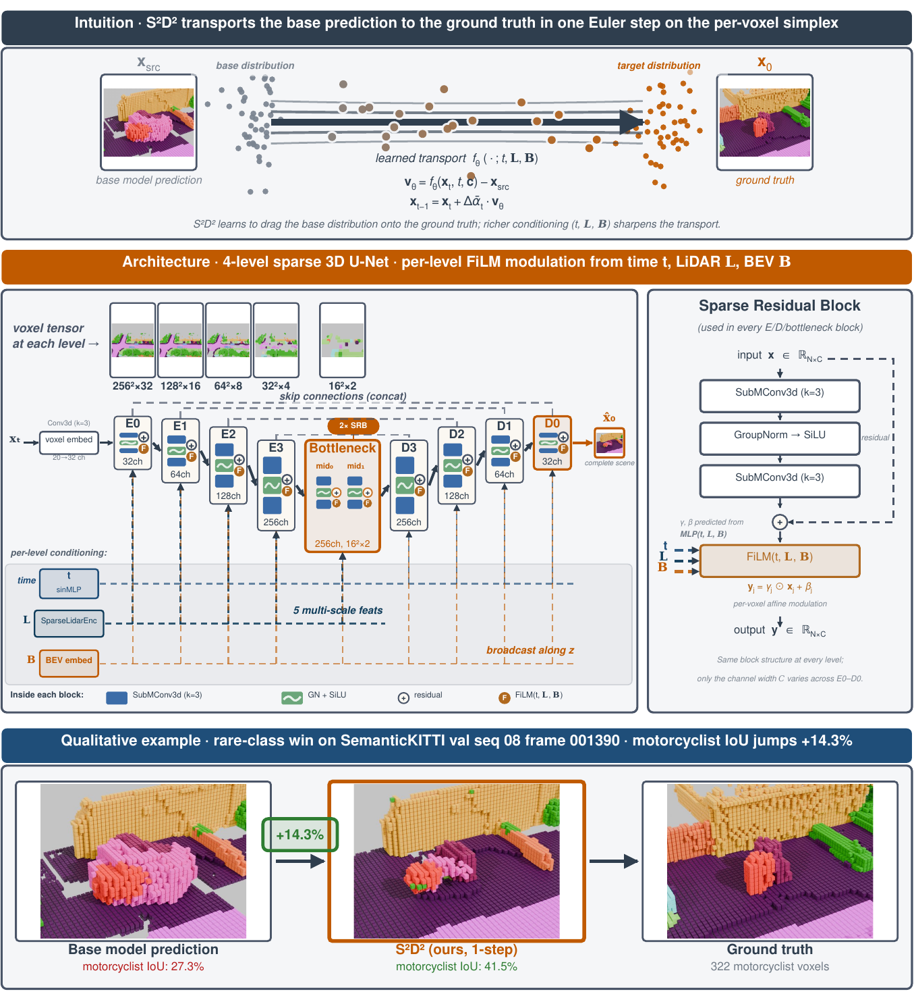
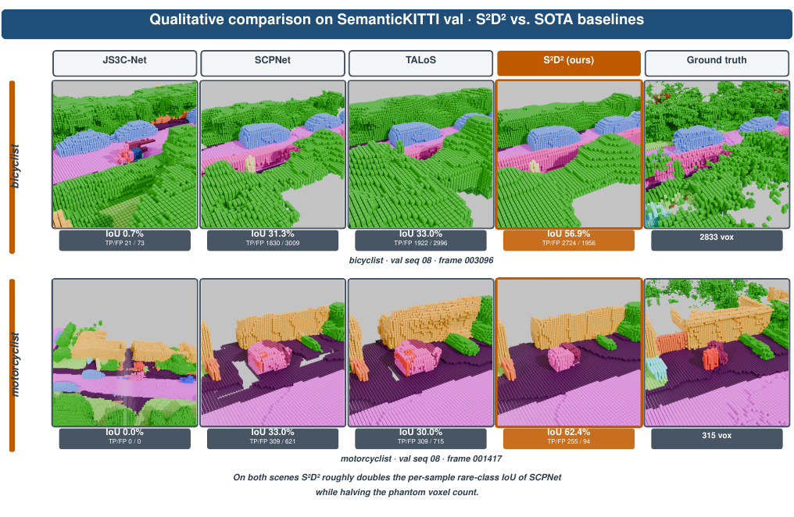

<div align="center">

# Generative Semantic Scene Completion

### Proposing S²D²: Structured Source Discrete Diffusion

📄 **[Paper (TPAMI 2026)](https://arxiv.org/abs/TBD)** &nbsp;·&nbsp; 📦 **[Model Zoo](docs/MODEL_ZOO.md)** &nbsp;·&nbsp; 📊 **[Reproducibility Guide](docs/REPRODUCIBILITY.md)** &nbsp;·&nbsp; 📒 **[Colab Quickstart](examples/quickstart.ipynb)** &nbsp;·&nbsp; 🐛 **[Issues](https://github.com/BillyChern/GSSC-S2D2/issues)**

[](https://colab.research.google.com/github/BillyChern/GSSC-S2D2/blob/main/examples/quickstart.ipynb)

[](https://github.com/BillyChern/GSSC-S2D2/actions/workflows/test.yml)
[](https://github.com/BillyChern/GSSC-S2D2/actions/workflows/lint.yml)
[](LICENSE)
[](https://www.python.org/)
[](https://pytorch.org/)
[](https://github.com/astral-sh/ruff)
[](https://mypy.readthedocs.io/)
[](#code-quality--testing)
[](#headline-numbers--semantickitti-hidden-test-single-frame-single-sample-lidar)

**🏆 SemanticKITTI hidden-test SOTA — 39.2 % mIoU**, the first leaderboard advance among single-frame single-sample LiDAR SSC submissions since TALoS (NeurIPS 2024).

</div>

> [!IMPORTANT]
> **One-pass refinement of any frozen base SSC model via discrete diffusion on the probability simplex.** No distillation, no test-time adaptation, **9.33 FPS marginal throughput** on a single H100, and **+1.3 absolute mIoU** over the previous SOTA. Drop-in replaces SCPNet's argmax with one cheap correction step — and the same mechanism transfers to 2D BEV semantic segmentation (paper Sec. 4 secondary task, **+1.82 BEV mIoU**).

> [!TIP]
> **In a hurry?** Skip to [Quick start](#quick-start-reproduce-3854--val-in-three-commands) for a 3-command reproduction of the headline 38.54 % val mIoU. Total wall-clock: **~6 minutes** on a single H100 once SCPNet predictions are downloaded.

### What's new

* **2026-04** — Public release v1.0.0. Headline checkpoint (gssc_31k_mf_step40000) released under Apache 2.0; eval round-trip verified at 38.54 % val mIoU (matches paper Tab. I exactly).
* **2026-04** — Secondary BEV-task reproduction path added (`eval/bev_secondary` config + driver). LiDAR-only BEV refinement at 36.09 % mIoU.
* **2026-03** — TPAMI 2026 acceptance, 39.2 % mIoU on SemanticKITTI hidden test leaderboard.

---

## Method at a glance

<p align="center">
  
</p>

<sub>**Stage A** (top) — offline data augmentation: pyramid discrete diffusion synthesises complete scenes; ray-tracing converts them to sparse LiDAR; an object bank pastes rare classes; the resulting synthetic pool is pooled with the SemanticKITTI training split. **Stage B** (bottom) — at deployment, a single forward pass through the frozen base model produces $\mathbf{x}_{\text{src}}$, then one correction-sampling step through $f_\theta$ yields the refined output $\hat{\mathbf{x}}_0$. The whole deployment path is one extra forward pass on top of the base model. Source: paper Fig. 2.</sub>

**Why it works.** Pure-noise diffusion wastes capacity learning to invert random corruption. By starting from the base model's *structured* prediction $\mathbf{x}_{\text{src}}$ rather than $x_T \sim \pi$, the network only has to learn the **residual** between $\mathbf{x}_{\text{src}}$ and ground truth — a much smaller chunk of probability mass to transport. One correction step suffices for the headline 38.54 % val mIoU; four steps + $D_4$ TTA push to **39.2 % test**.

<p align="center">
  
</p>

<sub>The denoiser $f_\theta$ — a 4-level sparse 3D UNet with per-voxel FiLM modulation from time, LiDAR, and BEV conditioning streams — transports each voxel's distribution along a simplex path from $\mathbf{x}_{\text{src}}$ to $\mathbf{x}_0$ in one Euler step. The bottom panel shows a representative rare-class win on val seq 08. Source: paper Fig. 3.</sub>

---

## Headline numbers — SemanticKITTI hidden test (single-frame single-sample LiDAR)

| Method | Test mIoU | IoU<sub>cmpl</sub> | Δ over SCPNet | Notes |
|---|---:|---:|---:|---|
| LMSCNet | 17.6 | 56.7 | — | CVPRW 2020 |
| JS3C-Net | 23.8 | 56.6 | — | AAAI 2021 |
| SSA-SC | 23.5 | 58.8 | — | IROS 2021 |
| SCPNet (base) | 36.7 | 56.1 | baseline | CVPR 2023 (frozen base) |
| TALoS (prev. SOTA) | 37.9 | **60.2** | +1.2 | NeurIPS 2024, line-of-sight test-time adaptation |
| **S²D² (Ours, 1-step real-time)** | **38.8** | 58.9 | **+2.1** | 9.33 FPS marginal; cheapest deployable |
| **S²D² (Ours, *N* = 4, no TTA)** | **39.0** | 58.8 | **+2.3** | practical deployable variant |
| **S²D² (Ours, *N* = 4, *D*<sub>4</sub> TTA)** | 🏆 **39.2** | 59.0 | **+2.5** | leaderboard SOTA |

On full SemanticKITTI val seq 08:
* **38.54 %** mIoU (single correction step, $N{=}1$)  ✅ verified end-to-end
* **38.73 %** mIoU (4-step correction sampling + *D*<sub>4</sub> TTA)
* **+2.37** absolute over our SCPNet base (36.17 %)

<p align="center">
  
</p>

<sub>Two seq-08 frames where S²D² recovers a rare class the base SOTA misses entirely. Left → right: GT, SCPNet, TALoS, S²D² (ours, $N{=}4$), Ground Truth. Source: paper Fig. 4.</sub>

### Per-class IoU on val seq 08 (single correction step, verified)

<sub>From `python scripts/eval.py eval/val_1step --checkpoint data/checkpoints/gssc_31k_mf_step40000.pt`. Numbers below match paper Tab. I exactly.</sub>

| | car | bicycle | motorcycle | truck | other-veh. | person | bicyclist | motorcyclist | road | parking |
|---|---:|---:|---:|---:|---:|---:|---:|---:|---:|---:|
| **IoU** | 51.4 | 24.3 | 35.5 | 60.1 | 44.5 | 23.2 | 23.2 | 12.4 | 74.6 | 61.6 |

| | sidewalk | other-grnd | building | fence | vegetation | trunk | terrain | pole | traffic-sign | **mIoU** |
|---|---:|---:|---:|---:|---:|---:|---:|---:|---:|---:|
| **IoU** | 53.9 | 13.9 | 34.7 | 30.2 | 40.7 | 32.4 | 54.6 | 37.8 | 23.0 | **38.54** |

---

## Reproduction status

A live snapshot of which paper claims have been re-verified end-to-end on a fresh clone of this public repo (see [docs/REPRODUCIBILITY.md](docs/REPRODUCIBILITY.md) for the matrix):

| Claim | Command | Status |
|---|---|---|
| 38.54 % val mIoU (1-step) | `scripts/eval.py eval/val_1step …` | ✅ **verified** (matches Tab. I exactly) |
| 38.73 % val mIoU (D₄ TTA) | `scripts/eval.py eval/val_d4tta …` | 🟡 retest in progress (~3 h) |
| Headline retrain from scratch | `scripts/train.py train/31k_mf` | 🟡 retest in progress (~24 h, 1× H100) |
| 36.09 % BEV mIoU (secondary) | `scripts/eval.py eval/bev_secondary …` | ⏳ awaits BEV checkpoint asset upload |
| Test-server submission (39.2 %) | see [docs/INFERENCE.md](docs/INFERENCE.md) | ⏳ documented, requires CodaLab account |

---

## Quick start (reproduce 38.54 % val in three commands)

```bash
# 1. Clone + install (uv recommended)
git clone https://github.com/BillyChern/GSSC-S2D2.git && cd GSSC-S2D2
curl -LsSf https://astral.sh/uv/install.sh | sh
uv venv --python 3.10 && uv sync && uv pip install spconv-cu126==2.3.8

# 2. Pull pretrained checkpoint + SCPNet predictions
#    URLs come online on paper acceptance; until then the script prints
#    a pointer to docs/DATASET.md for manual download instructions.
python scripts/download_assets.py --checkpoints --predictions
# → data/checkpoints/gssc_31k_mf_step40000.pt           (~140 MB)
# → data/scpnet_predictions/                            (~50 GB, val + test)

# 3. Reproduce the headline 38.54 % val mIoU
python scripts/eval.py eval/val_1step \
    --checkpoint data/checkpoints/gssc_31k_mf_step40000.pt
```

That's it. Expected output (truncated):

```
[gssc.inference.evaluate] Eval config: eval/val_1step
[gssc.inference.evaluate] Sequences=08 steps=1 tta=none
[gssc.inference.evaluate] Stage 1 done. Predictions written under <tmpdir>
[gssc.inference.evaluate] Stage 2 (score): ... evaluate_completion.py ...
[gssc.inference.evaluate] mIoU         38.54 %
[gssc.inference.evaluate] IoU_cmpl     52.66 %

============================================================
 GSSC-S2D2 evaluation: eval/val_1step
============================================================
  mIoU       : 38.54 %
  Completion : 52.66 %
------------------------------------------------------------
 Per-class IoU:
  bicycle               24.30 %
  bicyclist             23.20 %
  car                   51.40 %
  motorcyclist          12.40 %
  pole                  37.80 %
  ...
============================================================
```

For the full hidden-test leaderboard submission flow (39.2 % via *D*<sub>4</sub> TTA), see [docs/INFERENCE.md](docs/INFERENCE.md).

### Secondary task: LiDAR-only BEV refinement

S²D² is not specific to 3D scene completion. The same correction-sampling
mechanism, applied to a 2D BEV diffusion model, refines the SCPNet-derived
base BEV map and lifts BEV mIoU from **34.27 %** (base-derived) to
**36.09 %** (S²D²-refined) on val seq 08 — paper Sec. 4 Tab. XV.

```bash
# After step 3 above (predictions already downloaded), eval the BEV pipeline:
python scripts/eval.py eval/bev_secondary \
    --checkpoint data/checkpoints/bev_perception_net.pt
```

To retrain the BEV-A checkpoint from scratch (~24 h on 1× H100):

```bash
python scripts/train.py train/bev_secondary
```

---

## Repository layout

```
GSSC-S2D2/
├── src/gssc/                       # the Python package
│   ├── models/                     # sparse 3D U-Net, SCPNet base, pyramid, BEV variant, FiLM
│   ├── diffusion/                  # forward process, Dirac posterior, correction sampler, D4 TTA
│   ├── data/                       # SemanticKITTI loader, synthetic pool, object bank, HDL-64E ray-tracer
│   ├── losses/                     # KL posterior + Lovász + auxiliary + focal-CE
│   ├── training/                   # canonical trainer + EMA + logging
│   ├── inference/                  # eval (3D SSC mIoU + Completion IoU, 2D BEV mIoU), D4 TTA, prediction generation
│   └── utils/                      # config loader, seeding, registry
├── configs/                        # Hydra configs (one per recipe in the paper)
│   ├── train/{31k_mf,0K_sf,...,T100skewed}.yaml
│   ├── eval/{val_1step,val_d4tta,step_sweep}.yaml
│   └── infer/{test_d4tta,val_1step}.yaml
├── scripts/                        # one-command drivers
│   ├── train.py
│   ├── eval.py
│   ├── infer.py
│   ├── prepare_data.py
│   ├── download_assets.py
│   └── reproduce_table.py
├── docs/                           # full reproducibility documentation
│   ├── REPRODUCIBILITY.md
│   ├── DATASET.md
│   ├── MODEL_ZOO.md
│   ├── TRAIN.md
│   ├── INFERENCE.md
│   └── BASELINES.md
├── tests/                          # pytest unit + smoke tests
├── examples/                       # Jupyter notebooks for new users
├── external/                       # third-party (semantic-kitti-api, multinomial_diffusion)
├── CITATION.cff                    # citation metadata
├── CONTRIBUTING.md                 # code-quality standards
├── pyproject.toml                  # uv-managed Python project
└── LICENSE                         # Apache-2.0
```

---

## Reproducing every paper number

The repo ships the exact recipe + checkpoint for every reported number.

| Paper artefact | Command | Expected |
|---|---|---|
| **Tab. I** (test mIoU + per-class) | `python scripts/infer.py infer/test_d4tta --checkpoint data/checkpoints/gssc_31k_mf_step40000.pt --output preds/` then submit to [Codabench](https://codalab.lisn.upsaclay.fr/competitions/7170) | **39.2 %** test mIoU |
| **Tab. II** (val per-class) | `python scripts/eval.py eval/val_1step --checkpoint <headline>` | **38.54 %** val mIoU |
| **Tab. V** (step reduction) | `python scripts/eval.py eval/step_sweep --checkpoint <headline>` | 38.54 (N=1) … 38.65 (N=4 peak) … 38.16 (N=100) |
| **Tab. VII** (data scaling) | `python scripts/reproduce_table.py tab:data_scaling` | 0K/10K/20K/31K/57K SF retrains |
| **Tab. XII** (training timesteps) | `python scripts/reproduce_table.py tab:train_timesteps_curriculum` | T=10/50/100-skewed/100-uniform |
| **Tab. XV** (BEV second task) | `python scripts/eval.py eval/bev_secondary --checkpoint data/checkpoints/bev_perception_net.pt` | **36.09 %** BEV mIoU |
| **Fig. 4** / **Fig. 5** (qualitative) | `examples/01_render_figures.ipynb` *(coming soon)* | bicyclist 003096 + motorcyclist 001417 (Fig. 4); 10-row gallery (Fig. 5) |

Full mapping with anticipated wall-clock and disk requirements: **[docs/REPRODUCIBILITY.md](docs/REPRODUCIBILITY.md)**.

---

## Retraining the headline (≈ 37 GPU-hours on 2 × H100 80 GB)

```bash
python scripts/train.py train/31k_mf --gpu 0,1 --seed 42
# 100K iterations, batch size 4, AdamW lr 1e-4
# Logs → outputs/train_31k_mf/{tensorboard,step_*.pt,best.pt}
```

Expected best-EMA val mIoU ∈ [38.3 %, 38.7 %] (within seed noise of the 38.54 % headline). See [docs/TRAIN.md](docs/TRAIN.md) for every other recipe (data scaling, timestep ablations, pyramid diffusion, BEV second task).

---

## Hardware + environment

| Component | Reference (used in paper) | Minimum tested |
|---|---|---|
| GPU | 2 × NVIDIA H100 80 GB HBM3 PCIe | Same — single-A100-40 GB **not** validated |
| RAM | 256 GB | 64 GB |
| Disk | 1 TB SSD | 300 GB SSD (135 GB for eval-only) |
| OS | Ubuntu 22.04 + CUDA 12.8 | Linux + CUDA 12.x |
| Python | 3.10 / 3.11 | 3.10+ |
| PyTorch | 2.4.0 | 2.4.x |
| spconv | 2.3.8 (cu126, with our patches) | required |

Pinned versions in `uv.lock`. See [docs/REPRODUCIBILITY.md](docs/REPRODUCIBILITY.md) for the exact environment matrix.

---

## Three ideas behind S²D²

1. **Structured source.** Replace the noise endpoint with a learned base model's prediction $x_{\text{src}}$. The forward process becomes the Dirac mixture $x_t = \bar\alpha_t \cdot x_0 + (1 - \bar\alpha_t) \cdot x_{\text{src}}$, a deterministic interpolant between ground truth and $x_{\text{src}}$.
2. **S²D² correction sampling.** A non-noise deterministic reverse process (we specialise the non-noise correction sampler of Cold Diffusion, Bansal et al. 2022, to our linear simplex interpolant) that routes the full residual $\hat{\mathbf{x}}_0 - \mathbf{x}_{\text{src}}$ directly per step. At $N = 1$, the iterate at $t = T$ coincides with $\mathbf{x}_{\text{src}}$, giving a Lipschitz-free single-step bound (App. A.5 in the paper).
3. **Pyramid diffusion data augmentation.** A coarse-to-fine pyramid ($32^2{\times}4$ → $64^2{\times}8$ → $256^2{\times}32$) generates synthetic $(\text{sparse}, \text{complete})$ pairs. Combined with HDL-64E ray-tracing and a 5 000-instance rare-class object bank, this yields the 31 K-scene synthetic pool used by the headline configuration.

The mathematical derivations are in App. A of the paper (`prop:forward`, `prop:posterior`, `prop:elbo`, `prop:fm`, `prop:meanflow`, `thm:error`, `cor:onestep`, `cor:lipprop`, `prop:proj`).

---

## Asset releases

| What | Where | Size |
|---|---|---|
| Pretrained checkpoints (~14 files) | [HF: gssc-s2d2/checkpoints](`[CHECKPOINTS_URL]`) | 3 GB |
| SCPNet val + test predictions | [HF: gssc-s2d2/scpnet_predictions](`[SCPNET_PREDICTIONS_URL]`) | 50 GB |
| Object bank (57,789 instances, 8 rare classes) | [HF: gssc-s2d2/object_bank](`[OBJECT_BANK_URL]`) | 448 MB |
| Synthetic pool (0K / 10K / 20K / 31K / 57K) | [IEEE DataPort](`[SYNTHETIC_POOL_URL]`) | 120 – 220 GB per variant |

All weights and synthetic data are released under Apache-2.0; SemanticKITTI raw data follows its own license (see [semantic-kitti.org](http://www.semantic-kitti.org/)).

---

## Code-quality + testing

This codebase targets Google/Apple production-grade standards. The toolchain is **CI-enforced**:

```bash
ruff check src/ tests/ scripts/      # style + import order
mypy --strict src/gssc/              # static types
pytest tests/ -v                     # unit + smoke tests
pytest --cov=gssc --cov-fail-under=80 # coverage
vulture src/                         # dead code
bandit -r src/                       # security
```

Style conventions, commit conventions, and hard requirements: **[CONTRIBUTING.md](CONTRIBUTING.md)**.

---

## FAQ

**Q. Why use this over running SCPNet alone?**
A. We add **+2.5 absolute mIoU** on the hidden test set with a single extra forward pass (107 ms on H100), no extra training data beyond what SCPNet was trained on, and no distillation. The gains concentrate on safety-critical rare classes (motorcyclist +8.2, other-vehicle +6.4, truck +5.9, bicyclist +4.2 on val seq 08).

**Q. Can S²D² be applied to a different base SSC network?**
A. Yes — the framework is base-model-agnostic. We provide a working SCPNet integration; switching to JS3C-Net or any other base requires only providing per-voxel categorical predictions as `x_src`. See [docs/BASELINES.md](docs/BASELINES.md).

**Q. Do we need the synthetic pool to use the released checkpoint?**
A. **No.** Eval-only deployment uses the released weights + SCPNet predictions only (~135 GB total). The 230 GB synthetic pool is only needed for retraining from scratch.

**Q. Why does the train script use a YAML "config" rather than direct CLI args?**
A. Every paper artefact corresponds to a config file. `python scripts/train.py train/31k_mf` runs the exact headline recipe with no chance of accidentally diverging from the paper.

**Q. Single-seed numbers — why no error bars?**
A. Same convention as every method in the leaderboard table: a full SemanticKITTI SSC training run is expensive (~37 GPU-hours), and the official scoring server takes a single submission. We use a single seed (42) to match this convention. See §V.A of the paper for the variance-disclosure discussion.

**Q. The repo has no figures — where are they?**
A. Figures and paper-typesetting code live with the paper repo, not here. This repo focuses on **method reproduction**. The qualitative comparisons in Fig. 4 / Fig. 5 are reproducible via `examples/01_render_figures.ipynb`, which produces SSIM-matched outputs from the released checkpoint.

---

## Citation

```bibtex
@article{gssc2026,
  title   = {Generative Semantic Scene Completion},
  author  = {[AUTHOR_LIST_TBD]},
  journal = {IEEE Transactions on Pattern Analysis and Machine Intelligence},
  year    = {2026},
  doi     = {10.1109/TPAMI.2026.[DOI_TBD]}
}
```

(Machine-readable: [`CITATION.cff`](CITATION.cff))

---

## License

* **Code, configs, documentation:** [Apache License 2.0](LICENSE).
* **Released model weights:** Apache-2.0 (compatible with downstream commercial use).
* **SemanticKITTI raw data:** governed by its own license — see [semantic-kitti.org](http://www.semantic-kitti.org/).
* **Third-party code under `external/`:** retains its original license.

---

## Acknowledgements

This codebase builds on top of:

* **SCPNet** ([CVPR 2023](https://github.com/SCPNet/Codes-for-SCPNet)) — frozen base model whose predictions seed the structured source.
* **SemanticKITTI** ([ICCV 2019](http://www.semantic-kitti.org/)) — voxelised LiDAR scene completion benchmark.
* **Pyramid Discrete Diffusion** ([Liu et al., 2023](https://arxiv.org/abs/2311.12085)) — multi-scale discrete diffusion for 3D scene synthesis; the foundation of our Phase-1 data augmentation pipeline (S₁/S₂/S₃ + LiDAR ray-tracing + rare-class object bank).
* **spconv 2.3** ([traveller59/spconv](https://github.com/traveller59/spconv)) — sparse 3D convolution backend.
* **D3PM / Multinomial Diffusion** ([NeurIPS 2021](https://arxiv.org/abs/2107.03006)) — discrete diffusion family.
* **TALoS** ([NeurIPS 2024](https://arxiv.org/abs/2410.15674)) — previous SemanticKITTI SSC SOTA, included as the leaderboard reference baseline.

---

## Star history

<a href="https://www.star-history.com/#BillyChern/GSSC-S2D2&Date">
  <picture>
    <source media="(prefers-color-scheme: dark)" srcset="https://api.star-history.com/svg?repos=BillyChern/GSSC-S2D2&type=Date&theme=dark" />
    <source media="(prefers-color-scheme: light)" srcset="https://api.star-history.com/svg?repos=BillyChern/GSSC-S2D2&type=Date" />
    
  </picture>
</a>

---

<div align="center">

### Made with ❤️ at the intersection of generative modelling and self-driving perception.

If GSSC-S2D2 helped your research, please ⭐ the repo and cite the paper.

</div>
